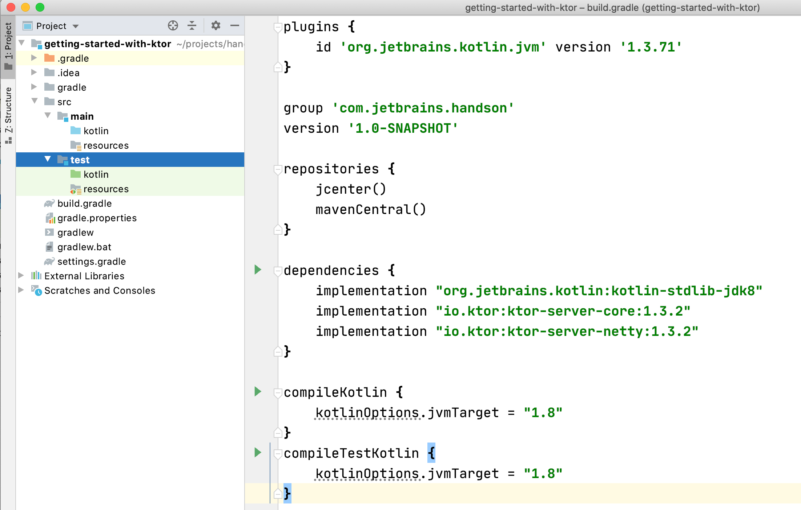

# Creating the Project

Ktor projects can be created using either Gradle or Maven. We can use [start.ktor.io](https://start.ktor.io) as a starting point to create new projects, or alternatively use the Ktor 
[IntelliJ IDEA plugin](https://plugins.jetbrains.com/plugin/10823-ktor) for that performs the same steps as the web wizard. However, in this tutorial we're going to create the project from scratch so that
we understand how things are built. If we want to speed things up, we always have the option of using the aforementioned plugin or web wizard to speed things up.


### Getting the right dependencies

Ktor is split up into multiple artifacts allowing for fine-grained control. Depending on what we need, we can include the [corresponding artifacts](https://ktor.io/quickstart/artifacts.html).
All Ktor packages are available on [Bintray](https://bintray.com/kotlin/ktor/).

### Setting up the Gradle build file

Let's create a new `build.gradle` file, either using [IntelliJ IDEA](https://jetbrains.com/idea) project wizard or manually, and fill it with the following configuration:


```groovy
plugins {
    id 'org.jetbrains.kotlin.jvm' version '1.3.71'
}

group 'com.jetbrains.handson'
version '1.0-SNAPSHOT'

repositories {
    jcenter()
    mavenCentral()
}

dependencies {
    implementation "org.jetbrains.kotlin:kotlin-stdlib-jdk8"
    implementation "io.ktor:ktor-server-core:1.3.2"
    implementation "io.ktor:ktor-server-netty:1.3.2"
}

compileKotlin {
    kotlinOptions.jvmTarget = "1.8"
}
compileTestKotlin {
    kotlinOptions.jvmTarget = "1.8"
}
```

Note that in case of generating the `build.gradle` file using IntelliJ IDEA, the only lines we have to add are `jcenter()` in the `repositories` block  and the corresponding
dependencies for Ktor, in our case the following two: 

* `ktor-server-core`, which is required for all server-side applications
* `ktor-server-netty`, which is the module that provides us with the ability to self-host our applications using [Netty](https://netty.io/). 

Ktor allows applications to run within an Application Server compatible with Servlets, such as Tomcat, or as an embedded application, using Jetty, Netty or CIO. In our
case it will be Netty. If we were to use something else like Jetty, we'd include the corresponding module `server-jetty`.

Once we have our build file ready, we can reimport it (if within the IDE) to download the corresponding dependencies and start writing some code. Our 
project structure should look like the following:




