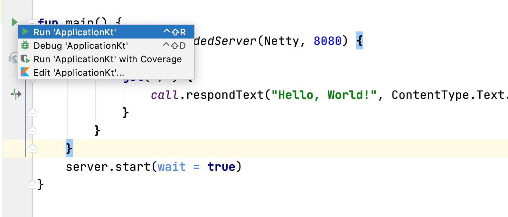
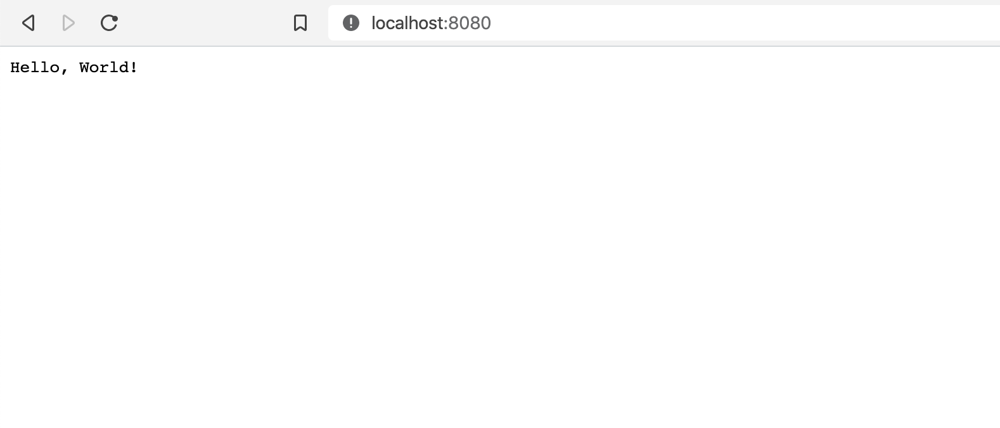

# Running the application

Now that we have the code in place, we can simply start the server 
by clicking on the **Run** button in the IDE or by building into from the command line
using `gradle build` and then running the application as we would run any 
[regular Kotlin application](https://kotlinlang.org/docs/tutorials/kotlin-for-py/compiling-and-running.html).

If there are no compilation errors, the server should start and we can now
make a request via a browser or any HTTP client to `http://localhost:8080/` getting
back the response

  

We've now successfully created our first Ktor server application. Ktor allows for much more functionality such as server creating websites, serving static content,
providing HTTP end-points for RESTful services, etc. For more information check out some of the [tutorials on Ktor](https://play.kotlinlang.org/hands-on) as well 
as the [documentation on ktor.io](https://ktor.io/servers/index.html).
