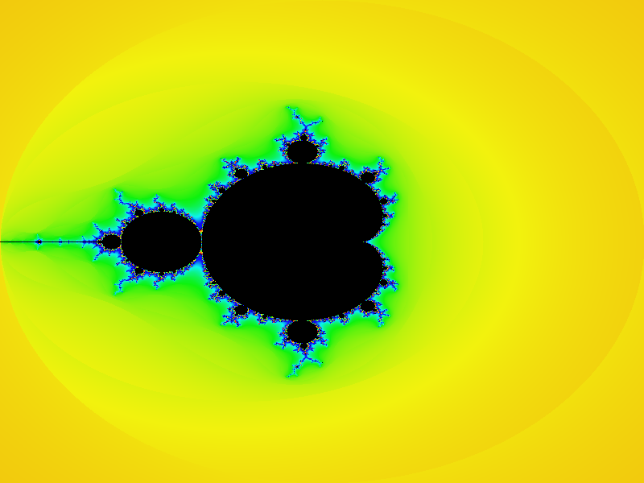
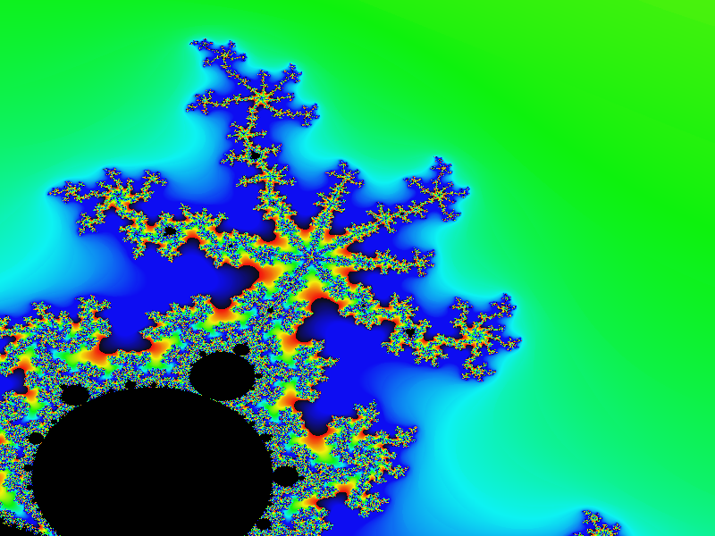
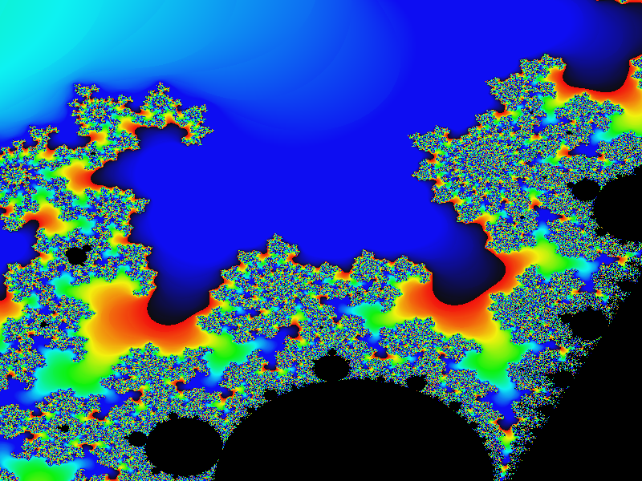

# Project Description

In the tutorial we will learn how to create a Kotlin Multiplatform project
to set up code reuse between a client side JavaScript application and a
server-side JVM applications. Throughout the tutorial we will
use the pre-implemented
[Mandelbrot Set](https://en.wikipedia.org/wiki/Mandelbrot_set)
rendering algorithm to run it for both 
server-side and client-side
image rendering.

We'll see how our JVM-only implementation can be turned into a
fully functional Kotlin multiplatform project compiled for the
JVM and JavaScript platforms.

## Basics

Fractals and the [Mandelbrot Set](https://en.wikipedia.org/wiki/Mandelbrot_set)
are good assignments at a computer science classes. All we need to know right now
is that every pixel of an image is mapped to 2D coordinates
(e.g. `0.03, 0.045`). We run slow computations for every pixel to figure out
the color of it. The best picture
is visible at the area of `[-2.0 .. 2.0] x [-2.0 .. 2.0]`

The Mandelbrot set is a fractal or a self repeating structure. If we zoom it,
we'll likely to see something similar to what we've seen before. It
opens up the use-case for any fractal rendering tools -- it should
support zoom feature 

or 

