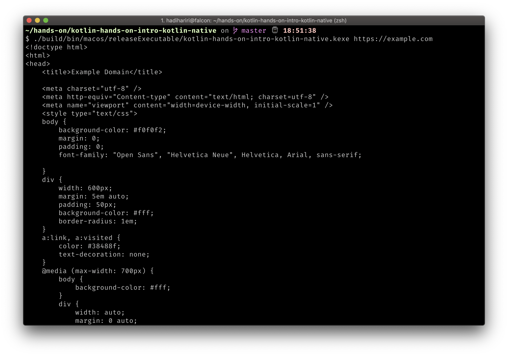

# A native HTTP Client

In this hands-on lab we're going to build a native HTTP command line client using [Kotlin/Native](https://kotlinlang.org/docs/reference/native-overview.html) technology.

The output will be an executable command line application that allows to make simple HTTP GET requests.

You can find the code for the hands-on lab on [GitHub](https://github.com/Kotlin/kotlin-hands-on-intro-kotlin-native)