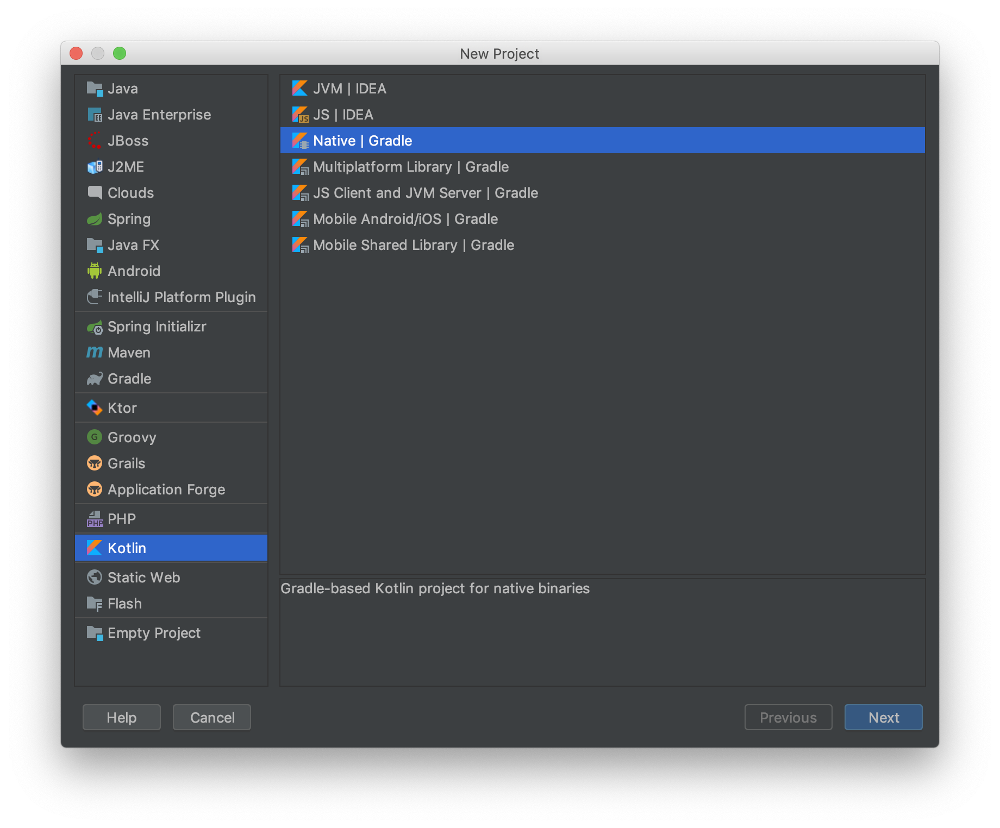
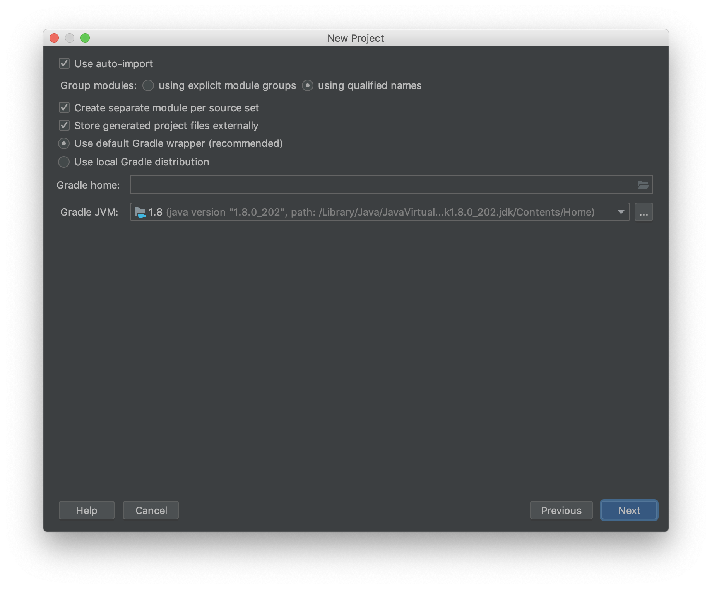
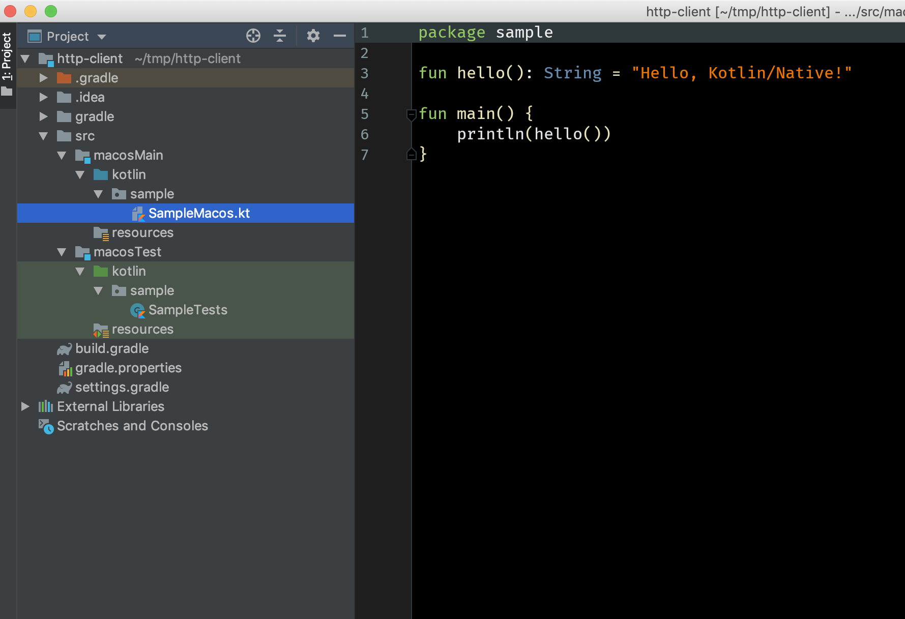

# Creating a Kotlin/Native project

A Kotlin/Native application can be written using any text editor
or IDE and then compiled using the Kotlin/Native compiler. In our case we're going to be using [IntelliJ IDEA](https://jetbrains.com/idea) to 
create, compile and run our application. It can be downloaded from [the JetBrains site](https://www.jetbrains.com/idea/download/). Both the Ultimate and Community Editions are valid.

To create a new Kotlin/Native project, you can use the Project Wizard. Click on **File | New | Project...** and select **Native | Gradle** from the **Kotlin** entry

  

Click **Next** and tick **use auto-import**



Click **Next**  and select the folder where you'll save your application, and click on **Finish**


The wizard will create a new project with some sample files/folders to get you started. The folder names depend on the system you're developing on. In the case of macOS, these will be called `macosMain` and `macosTest`. It's important to understand that
an application written in Kotlin/Native can target different platforms as long as the code that is being written does not have specific platform requirements. Usually any code that is common 
across all platforms would be placed in a folder named `commonMain` with its corresponding `commonTest`. For the purpose of this tutorial however, keep the folder structure as is.

A few sample files are also created to get you started. You can safely delete these.



## The Gradle Build File

Before going on to the next step, it's important to understand the `build.gradle` file that has been generated 

```groovy
plugins {
    id 'kotlin-multiplatform' version '1.3.31'
}
repositories {
    mavenCentral()
}
kotlin {
    // For ARM, should be changed to iosArm32 or iosArm64
    // For Linux, should be changed to e.g. linuxX64
    // For MacOS, should be changed to e.g. macosX64
    // For Windows, should be changed to e.g. mingwX64
    macosX64("macos") {
        binaries {
            executable {
                // Change to specify fully qualified name of your application's entry point:
               entryPoint = 'com.jetbrains.handson.http.main'
                // Specify command-line arguments, if necessary:
                runTask?.args('')
            }
        }
    }
    sourceSets {
        // Note: To enable common source sets please comment out 'kotlin.import.noCommonSourceSets' property
        // in gradle.properties file and re-import your project in IDE.
        macosMain {
        }
        macosTest {
        }
    }
}

// Use the following Gradle tasks to run your application:
// :runReleaseExecutableMacos - without debug symbols
// :runDebugExecutableMacos - with debug symbols
```

Targets are defined using `macOSX64`, `linuxX64` and `mingwX64` for macOS, Linux and Windows respectively. What is generated by default, much like the 
folder names depends on the platform where the wizard is run. In this case, it was generated on macOS and thus the entry `macosX64` is present. For a complete
list of supported platforms, please see the [documentation](https://kotlinlang.org/docs/reference/building-mpp-with-gradle.html#supported-platforms). 

The entry itself
defines a series of properties to indicate how the binary is generated and the entry point of the applications. These can be left as default values. 


