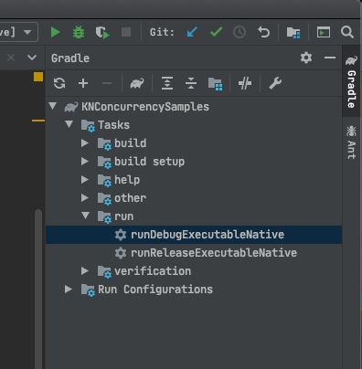

## 1) Simple State

First we'll start with some basic state. No global state. Nothing crossing threads. Just standard, local class instances. The goal of this example is to make sure we can run our sample project, and run some regular, non-concurrent code.

In Intellij, find the file `SampleMain.kt`. In the main function there will be code that is commented out. Look for `1) Simple State` and uncomment `runSimpleState()`.

Over on the right of the IDE, find "Gradle", then in that window, open `KNConcurrencySamples > Tasks > run`, find `runDebugExecutableNative` and double-click it.



This is a very basic sample. There's a class `SimpleState` with a `var` Int that we can increment and decrement. There's also a `report()` function which simply prints the value.

```kotlin
fun runSimpleState(){
    val s = SimpleState()
    s.increment()
    s.increment()
    s.report()
    s.decrement()
    s.report()
}

class SimpleState{
    var count = 0

    fun increment(){
        count++
    }

    fun decrement(){
        count--
    }

    fun report(){
        println("My count $count")
    }
}
```

This will print:

```
---------------
My count 2
My count 1
---------------
```

Regular class state that is not frozen remains mutable and behaves as you'd normally expect it to. If you're not using global values or crossing threads, Kotlin/Native is just like the other Kotlin flavors.