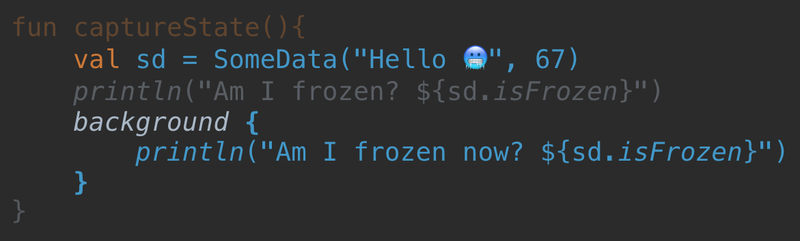

## 4) Background

We're going to leave the main thread now. In Kotlin/Native, if you are *directly* managing your concurrency, you'll probably be using `Worker`. `Worker` is Kotlin/Native's concurrency helper. Each `Worker` has it's own thread internally, and you can schedule work to be done on that thread.

We won't be going into detail about how to use `Worker` directly. It is kind of a low level feature, and pretty much all apps will use a concurrency library that sits on top of `Worker`. If you are familiar with Java's `Thread`, the situation is similar. Most developers are aware that `Thread` exists, but rarely use it directly.

Instead of using `Worker`, we're going to craft our own concurrency function called `background`.

```kotlin
fun background(block: () -> Unit) {
    val future = worker.execute(TransferMode.SAFE, { block.freeze() }) {
        it()
    }
    collectFutures.add(future)
}

private val worker = Worker.start()
private val collectFutures = mutableListOf<Future<*>>()
```

You call `background` with a lambda argument that executes state on another thread. The details of `Worker.execute` are a bit beyond what we're going to cover here, but the 2nd argument is a function to generate a parameter to the work function, and the 3rd is the work function itself, which gets run on a different thread.

The 2nd parameter returns a value which gets sent to the work function.  `Worker.execute` makes sure that parameter can be given to another thread. According to the 2 state rules, either the value is not referenced by anything in the current thread, and can be transferred and remain mutable (rule #1), or the value is frozen (rule #2).

While you can technically attempt to pass mutable state to other threads, in practice, Kotlin/Native concurrency libraries will automatically freeze state when passing between threads. A general model of Kotlin/Native concurrency libraries has emerged. To perform work in a different thread, you pass a lambda to a function. That lambda, and all of the data is captures, is frozen. `background` does the same.

For a simple example, run `basicBackground()`

```kotlin
fun basicBackground(){
    println("Is main thread $isMainThread")
    background {
        println("Is main thread $isMainThread")
    }
}
```

We've also created a property `isMainThread`, which, you can probably guess, will tell us if we're in the main thread. Running the function `basicBackground()` will print the following:

```
Is main thread true
Is main thread false
```

`basicBackground()` gets us onto another thread to do work, but obviously doesn't do much. This next example will pass some state into the other thread.

Run `captureState()`:

```kotlin
fun captureState(){
    val sd = SomeData("Hello 🥶", 67)
    println("Am I frozen? ${sd.isFrozen}")
    background {
        println("Am I frozen now? ${sd.isFrozen}")
    }
}
```

This will print:

```
Am I frozen? false
Am I frozen now? true
```

`sd` gets frozen when the lambda argument to `background` is frozen. It is very important to understand that concurrency function args can capture state, and when they are frozen, that state is also frozen.

As an alternate visualization, see below. When we call `background`, that function argument is frozen, and since it captures `sd`, which is a local val in the calling function, `sd` is also frozen.



Local values are easy to understand and deal with. Where this becomes more problematic, and triggers more controversy, is when you wind up capturing more state than you had intended.

Run `captureTooMuch()`

We'll be using a more complex model class that has a number you can increment, and when you do, we push that value into a "database" in the background, by way of the function `saveToDb(arg:Int)`:

```kotlin
class CountingModel{
    var count = 0

    fun increment(){
        count++
        background {
            saveToDb(count)
        }
    }

    private fun saveToDb(arg:Int){
        //Do some db stuff
        println("Saving $arg to db")
    }
}
```

Our function to use the model looks like this:

```kotlin
fun captureTooMuch(){
    val model = CountingModel()
    model.increment()
    println("I have ${model.count}")

    model.increment()
    println("I have ${model.count}") //We won't get here
}
```

What's the result? Our old friend, `InvalidMutabilityException`!

```
I have 1
Saving 1 to db
Uncaught Kotlin exception: kotlin.native.concurrent.InvalidMutabilityException: mutation attempt of frozen sample.CountingModel@17e01008
        at 0   KNConcurrencySamples.kexe   (nah)
        at 1   KNConcurrencySamples.kexe   (meh)
(etc)
        
```

To help illustrate the issue here, consider `captureTooMuchAgain()`

```kotlin
fun captureTooMuchAgain(){
    val model = CountingModel()
    println("model is frozen ${model.isFrozen}")
    model.increment()
    println("model is frozen ${model.isFrozen}")
}
```

This prints

```
model is frozen false
model is frozen true
```

`count` is an instance var of `CountingModel`, so capturing `count` in the way what we have will capture the whole model and freeze it.

To help avoid this, it is good practice to move thread-jumping code to another function, and only capture function arguments. Try `captureArgs()`:

```kotlin
fun captureArgs(){
    val model = CountingModelSafer()
    model.increment()
    println("I have ${model.count}")

    model.increment()
    println("I have ${model.count}")
}

class CountingModelSafer{
    var count = 0

    fun increment(){
        count++
        saveToDb(count)
    }

    private fun saveToDb(arg:Int) = background {
        println("Doing db stuff with $arg, in main $isMainThread")
    }
}
```

The modified `saveToDb` function above now handles the `background` call, and only captures the function argument. That won't freeze the parent class.
