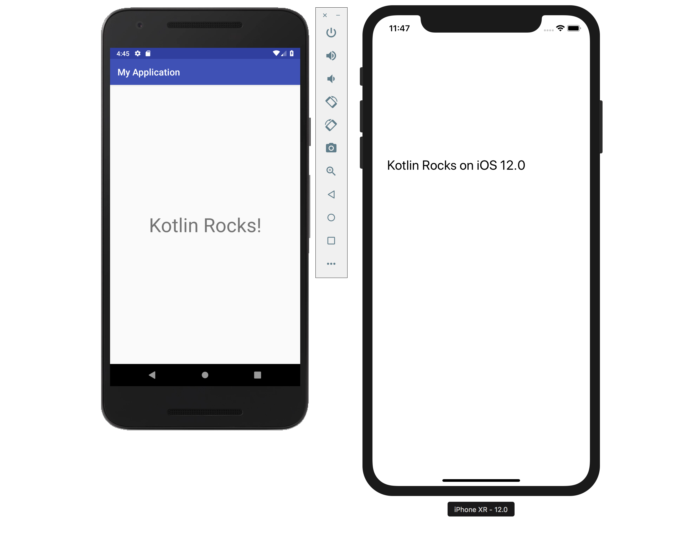

# Introduction

In this tutorial, we will create an application for both iOS and Android, making use of Kotlin's code sharing capabilities.
For Android, we'll be using Kotlin/JVM, while for iOS we'll use Kotlin/Native. 

We're going to learn how to:
 - Create an [Android app](#creating-an-android-project) using Android Studio
 - Create a shared [Kotlin library](#creating-the-shared-module)
   - Use the Kotlin library [from the Android app](#using-sharedcode-from-android)
   - Start the [Android application](#running-the-android-application)
 - Create an [iOS app](#creating-ios-application) using Xcode
   - Use the shared Kotlin library [from the iOS app](#setting-up-framework-dependency-in-xcode)
   - Call [Kotlin from Swift](#calling-kotlin-code-from-swift)
   - Start the [iOS application](#running-the-ios-application)

The application we're going to create will display the text 
`Kotlin Rocks on Android` on Android devices and `Kotlin Rocks on iOS <version>` on iOS devices.
Our goal is to demonstrate the ability to share Kotlin code between the platforms, the project setup, and the benefits that
this provides. While we'll be demonstrating this with a simple application, what is shown here can be applied to real-world applications, no matter their size or complexity.

The common code is `"Kotlin Rocks on ${platformName()}"`, where `platformName()` is 
a function that is declared using the `expect` keyword. The `actual` implementation will be specific to the platform.

# Setting Up the Local Environment

* We will be using [Android Studio](https://developer.android.com/studio/) for the Android part of the tutorial. 
It is also possible to use [IntelliJ IDEA](https://jetbrains.com/idea) Community or Ultimate edition.

* The Kotlin plugin 1.3.50 or higher should be installed in the IDE. This can be verified via
*Language & Frameworks | Kotlin Updates* section in the *Settings* (or *Preferences*) window.

* A macOS host operating system is required to compile for iOS and macOS devices. We need to have
[Xcode](https://developer.apple.com/xcode/) and the tools installed and configured. Check out
the [Apple Developer Site](https://developer.apple.com/xcode/) for more details. 

*Note: We'll be using IntelliJ IDEA 2019.2, Android Studio 3.4,
Kotlin 1.3.50, Xcode 10.3, macOS 10.14, Gradle 5.5.1*
