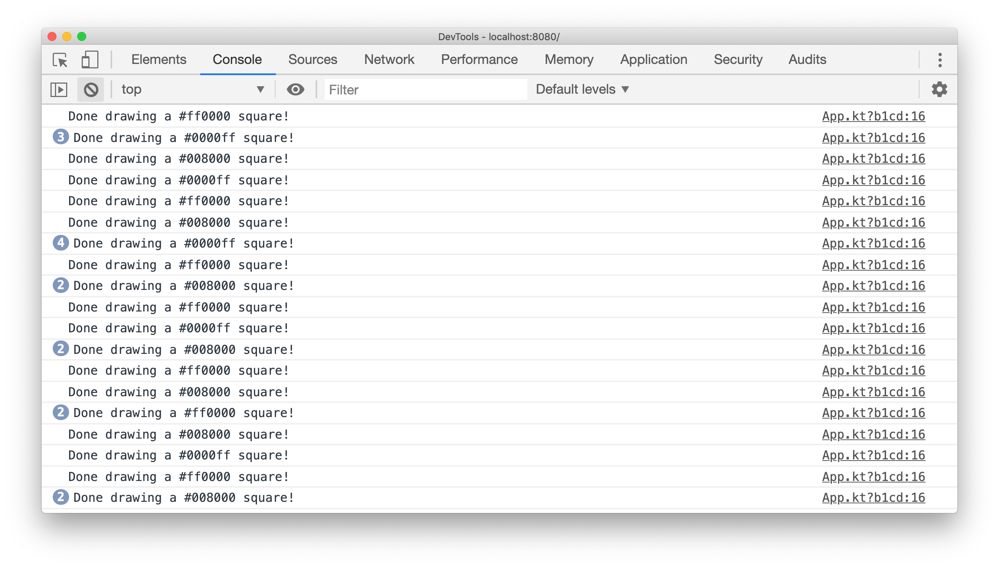
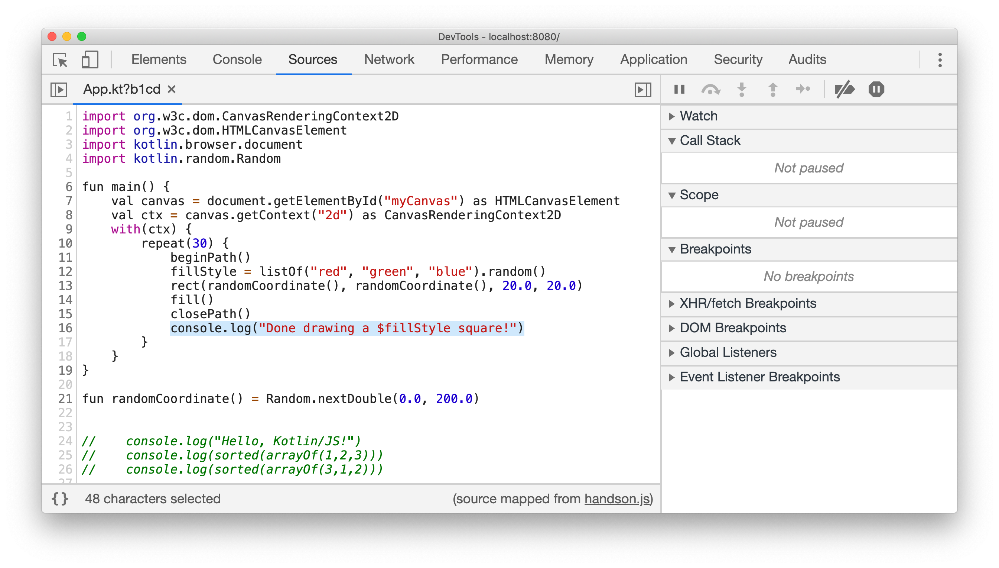
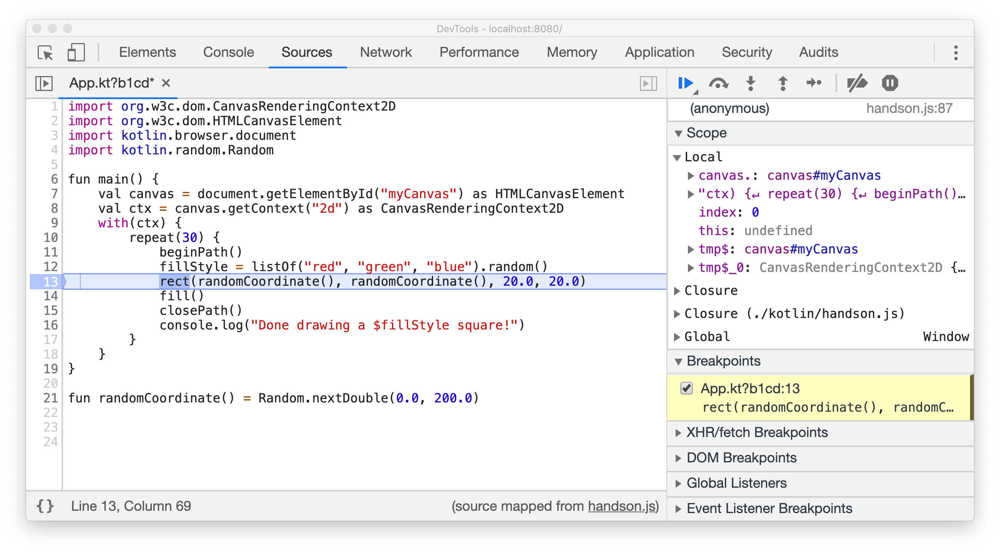

# Debugging in the browser

In a previous section, we've already very briefly been acquainted with the developer tools of our browser. But integration runs deeper than what we have seen previously. Let's investigate the code we've just written! On the loaded page, start your developer tools (for example by right-clicking and selecting the _Inspect_ action).

We can see our debug messages, and can see that the `App.kt` file is referenced on the right. When clicking on the file, we actually get to see our Kotlin source code right inside the developer tools.

For example, you can set a breakpoint by clicking on one of the line numbers. You can even set breakpoints within another statement!

As of Kotlin 1.3.60, source maps – the feature that allows you to see Kotlin code inside the browser window –  are generated automatically for your code targeting JavaScript through the Kotlin.JS plugin.

Feel free to play around with the tools and see what kind of cool features you can discover.